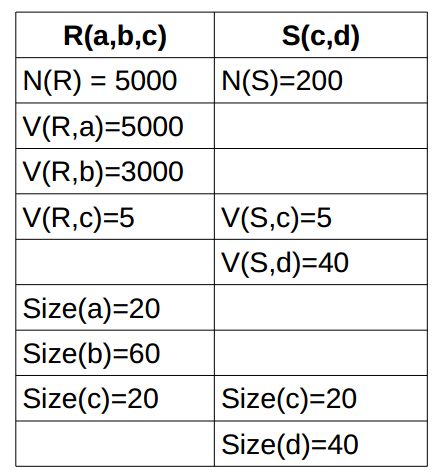

### Sean las relaciones R y S con los siguientes parámetros:

Teniendo en cuenta que el tamaño de bloque es de 2KB, que la cabecera es de
20B y que en memoria sólo cabe un bloque, determina el número de operaciones
de E/S que supondría la ejecución de la consulta:
$$\Pi_{a,d}(R JOIN S)$$

Los bloques de S:
$$L_S=20+40=60$$
$$Bfr_S=\lfloor\frac{B-C}{L_S}\rfloor=33$$
$$B_S=\lceil\frac{N(S)}{Bfr_S}\rceil=7$$
Los bloques de R:
$$L_R=20+60+20=100$$
$$Bfr_R=\lfloor\frac{B-C}{L_R}\rfloor=20$$
$$B_R=\lceil\frac{N(R)}{Bfr_R}\rceil=250$$
Ordenación de ambos:

$$O(R)=\lceil B(R)\times log_2(B(R)) \rceil=\lceil199.42\rceil=1992$$

$$O(S)=\lceil B(S)\times log_2(B(S)) \rceil=\lceil762.423\rceil=20$$

Los bloques del JOIN:
$$L_{JOIN}=100+60=160$$
$$Bfr_{JOIN}=\lfloor\frac{B-C}{L_{JOIN}}\rfloor=14$$
$$N(JOIN)=\frac{N_R\times N_S}{max(V(R,c),V(S,c))})=200000$$
$$B_{JOIN}=\lceil\frac{N(JOIN)}{Bfr_{JOIN}}\rceil=14286$$
Los bloques de la proyección:
$$L_{\Pi_{a,d}}=20+40=60$$
$$Bfr_{\Pi_{a,d}}=\lfloor\frac{B-C}{L_{\Pi_{a,d}}}\rfloor=33$$
$$B_{\Pi_{a,d}}=\lceil\frac{N(\Pi_{a,d})}{Bfr_{\Pi_{a,d}}}\rceil=6061$$

Resumen de operaciones E/S:

- Ordenaciónes 1992+20=2012
- El JOIN lee 250+7 y escribe 14286
- La proyección lee 14286 y escribe 6061
  
En total tenemos: 36902

