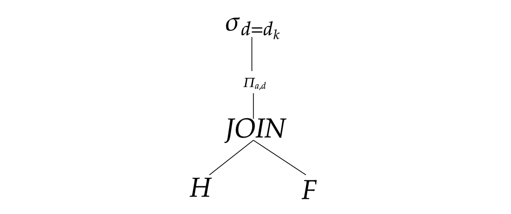
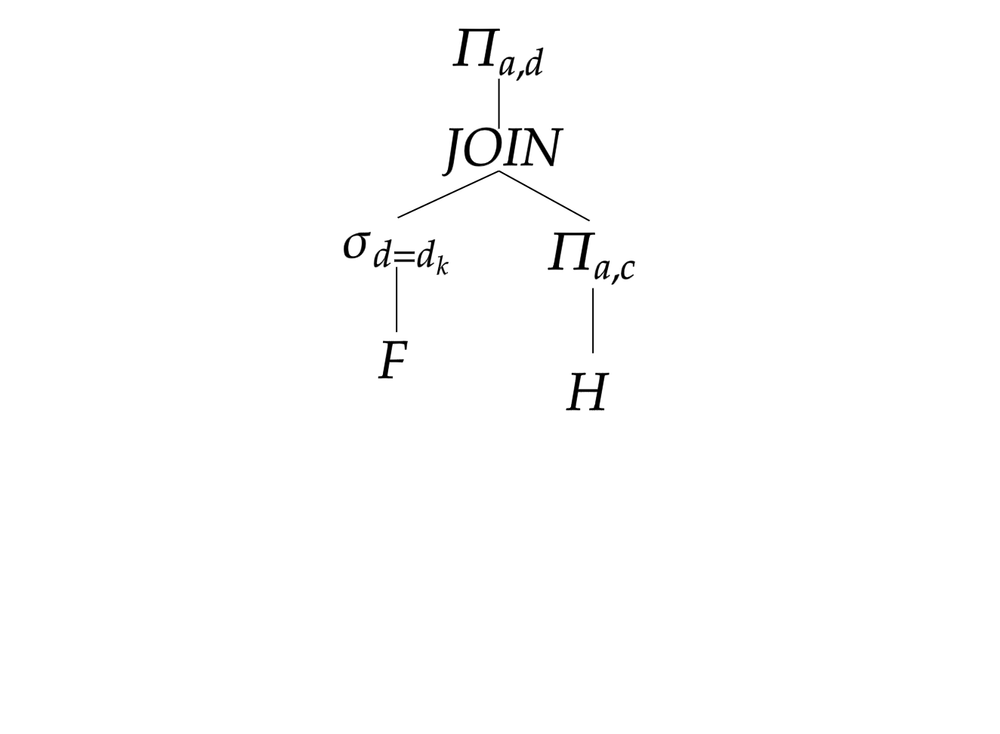

# ¿Que es un ASL?
Pag 37. Tema 1.

En un ASL, los archivos se siguen almacenando secuencial mente pero se intenta mejorar su acceso.  En este tipo de organización, los registros están ordenados según una clave física. Solo se utilizan registros de longitud fija, haciendo perder mucho espacio. Como la zona principal esta ordenada, la inserción seria costosa, por lo tanto se inserta en la zona de desbordamiento y cuando esta es mayor a la zona ordenada, se realiza una ordenación por mezcla. Teniendo todos los registros otra vez ordenados.

# Tipo test
Pag 24. Tema 3.

¿Que contiene una extensión?

- Un conjunto de bloques (Verdadera)
- Un conjunto de segmentos
- Un conjunto de registros
- Un conjunto de apuntadores

# Consulta
\
El bloqueo es fijo. El tamaño de bloque es 8KB y el tamaño de la cabecera es 50B.

## Tabla H
\
Clave primaria: "a". Clave externa: "c"

- Campo "a". Tipo: int. Size(a) = 50. V(H,a) = 2000
- Campo "b". Tipo: int. Size(b) = 20. V(H,b) = 1000
- Campo "c". Tipo: int. Size(c) = 200. V(H,c) = 100
## Tabla F
\
Clave primaria: "c". Clave externa: No tiene

- Campo "c". Tipo: int. Size(c) = 200. V(F,c) = 200
- Campo "d". Tipo: int. Size(d) = 30. V(F,d) = 50

La consulta seria:

$$ \Pi_{a,b}(\sigma_{d=d_{k}}(H JOIN F ))$$

## Plan logico
\

## Plan fisico 
\
Primero vamos a ver cuantos bloques son necesarios transferir en cada una de las operaciones. Calcularemos primero los bloques de H para realizar el JOIN:

$$  L(H) = 50+20+200 = 270$$

$$  Bfr(H) = \lfloor \frac{B-C}{L(H)}\rfloor = \lfloor \frac{8192-50}{270}\rfloor = 30$$

$$ B(H)= \lceil\frac{N(H)}{Bfr(H)}\rceil=\lceil\frac{2000}{30}\rceil=67 $$

Ahora calculamos los bloques de F:

$$  L(F) = 30+200 = 230$$

$$  Bfr(F) = \lfloor \frac{B-C}{L(F)}\rfloor = \lfloor \frac{8192-50}{230}\rfloor = 35$$

$$ B(F)= \lceil\frac{N(F)}{Bfr(F)}\rceil=\lceil\frac{200}{35}\rceil=6$$

Los bloques que leeremos serán:
$$ B(H)+B(F)=73$$

También tenemos que realizar un "mergesort" para ordenar datos. Llamaré __O(X)__ a la ordenación de X a partir de cualquiera de sus atributos, en este caso sera c, ya que es por el cual queremos hacer el JOIN.

$$ O(H)=\lceil B(H)\times log_2(B(H)) \rceil=\lceil406.428\rceil=407$$

$$ O(F)=\lceil B(F)\times log_2(B(F)) \rceil=\lceil15.5098\rceil=16$$

Ademas necesitamos suficientes bloques para guardar el resultado del JOIN.

$$  N(JOIN)=\frac{N(H)\times N(F)}{max[V(H,c),V(F,c)]}=\frac{2000\times 200}{max[100,200]}=2000 $$

$$ L(JOIN)=L(H)-L(F)-tamaño(c)=230+270-200=300 $$

$$  Bfr(JOIN) = \lfloor \frac{B-C}{L(JOIN)}\rfloor = \lfloor \frac{8192-50}{300}\rfloor = 27$$ 

$$  B(JOIN)= \lceil\frac{N(JOIN)}{Bfr(JOIN)}\rceil=\lceil\frac{2000}{27}\rceil=75   $$

Ahora tenemos que calcular la proyección.

$$ L(\Pi_{a,d})=50+30=80$$

$$ Bfr(\Pi_{a,d})=\lfloor\frac{B-C}{L(\Pi_{a,d})}\rfloor=\lfloor\frac{8192-50}{80}\rfloor=101$$
$$ B(\Pi_{a,d})=\lfloor\frac{N(\Pi_{a,d})}{Bfr(\Pi_{a,d})}\rfloor=\lfloor\frac{2000}{101}\rfloor=20$$

Lo ultimo que nos queda es calcular $$ \sigma_{d=d_{k}}$$

$$  N(\sigma_{d=d_{k}})=\frac{N(\Pi_{a,d})}{V(F,d)}=\frac{2000}{50} =40$$

$$  B(\sigma_{d=d_{k}})=\lceil \frac{N(\sigma_{d=d_{k}})}{Bfr(\Pi_{a,d})} \rceil = \lceil \frac{40}{101}\rceil = 1$$

En resumen tendremos que:

- O(H)=407 y O(F)=16
- JOIN lee B(H)+B(F)=73 y escribe 75
- $\Pi_{a,d}$ lee 75 y escribe 20
- $\sigma_{d=d_{k}}$ lee 20 y escribe 1

En total tenemos 687 operaciones de E/S

## Plan logico mejorado
\

## Plan físico mejorado
\
Al realizar antes la selección tendremos menos registros a la hora de realizar el JOIN. 
Primero calculamos los bloques de la selección.

$$N(\sigma_{d=d_k})=\frac{N(F)}{V(F,d)}=\frac{200}{50}=4$$
$$B(\sigma_{d=d_k})=\lceil\frac{N(\sigma_{d=d_k})}{Bfr(F)}=\lceil\frac{4}{35}\rceil=1$$

Ahora calculamos la proyección sobre H
$$L(\Pi{a,c})=50+200=250$$

$$Bfr(\Pi{a,c})=\lfloor\frac{8192-50}{L(\Pi{a,c})}\rfloor=\lfloor\frac{8142}{250}\rfloor=32$$

$$B(\Pi{a,c})=\lceil\frac{N(H)}{Bfr(\Pi{a,c})}\rceil=\lceil\frac{200}{32}\rceil=7$$

Como en el ejercicio anterior debemos ver el coste de ordenar tanto la proyección como la selección anterior:
$$ O(\sigma_{d=d_k})= \lceil B(\sigma_{d=d_k})*log_2(B(\sigma_{d=d_k})) \rceil =  \lceil 2*log_2(4) \rceil= 4 $$
$$ O(\Pi{a,c})= \lceil B(\Pi{a,c})*log_2(B(\Pi{a,c})) \rceil =  \lceil 7*log_2(7) \rceil= 20 $$

Ahora calcularemos los bloques necesarios para realizar el JOIN.

$$ L(JOIN) = L(\sigma_{d=d_k})+L(\Pi{a,c})-tamaño(c) = 230+250=480 $$

$$ Bfr(JOIN)=\lfloor \frac{8192-50}{L(JOIN)}\rfloor=\lfloor\frac{8142}{480}\rfloor=16$$
$$ N(JOIN)=\frac{N(\sigma_{d=d_k})\times N(\Pi{a,c})}{max[V(\Pi_{a,c},c),V(\sigma_{d=d_k},c)]}=\frac{4\times 200}{200}=4 $$
$$B(JOIN)=\lceil\frac{N(JOIN)}{Bfr(JOIN)}\rceil=\lceil\frac{4}{16}\rceil=1$$

Y por ultimo nos queda la proyección del JOIN.
$$ L(\Pi{a,d}) = 50 + 30= 80 $$

$$ Bfr(\Pi_{a,d})=\lfloor\frac{8192-50}{L(\Pi_{a,d})}\rfloor=\lfloor\frac{8142}{80}\rfloor=101 $$
 $$B(\Pi_{a,d})=\lceil\frac{N(\Pi_{a,d})}{Bfr(\Pi_{a,d})}\rfloor=\lfloor\frac{4}{101}\rfloor=1 $$

Ahora realizaremos un resumen de todas las operaciones E/S necesarias:

- La primera selección lee 6 y escribe 1.
- La primera proyección lee 67 y escribe 7.
- Ambas ordenaciones usarían 24 operaciones.
- El JOIN lee 1+7=8 y escribe 1
- Y la selección lee 1 y escribe 1

Teniendo un total de 116 operaciones de E/S.

